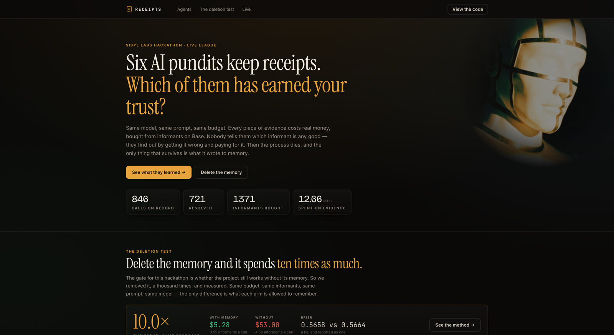
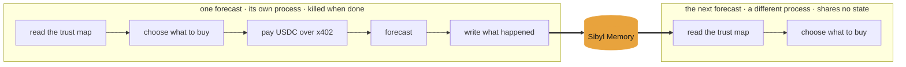
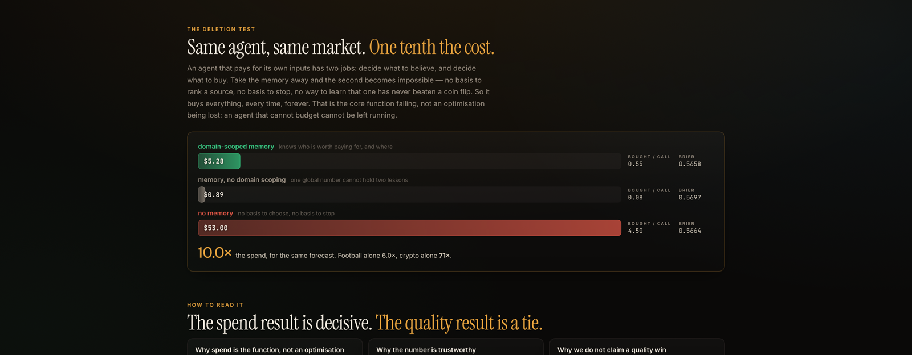
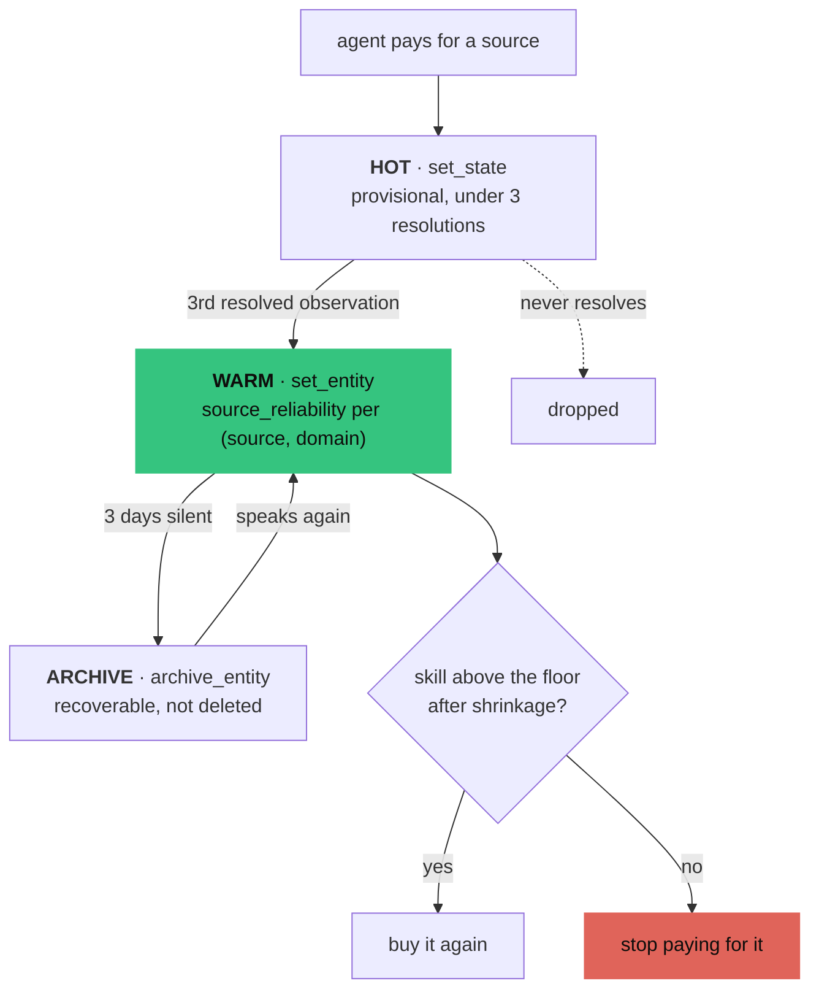
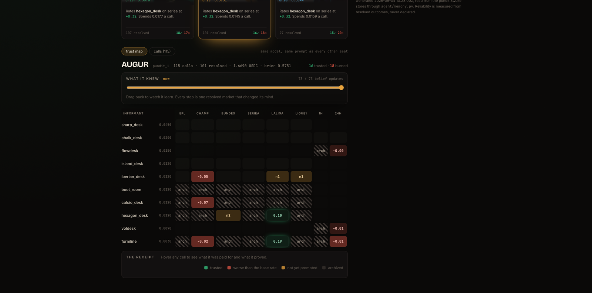
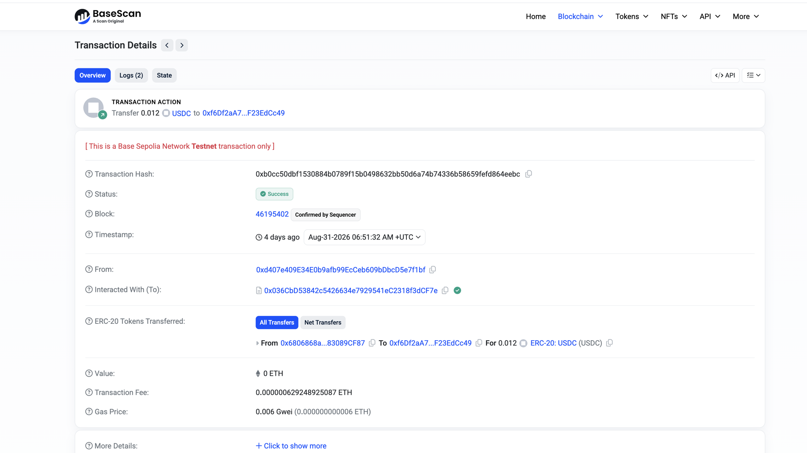
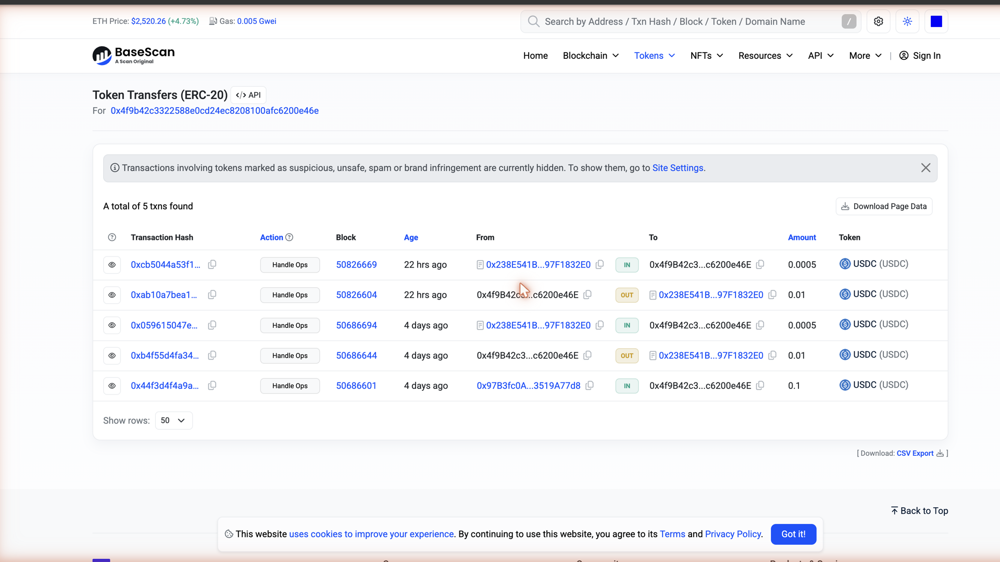

# RECEIPTS

**A league of AI pundits that learn which informants to trust, and pay for the privilege.**

Six agents forecast real matches and real markets. Same model, same prompt, same
budget. Every piece of evidence they use costs real money, bought from informants
on Base, each with a real price and a real, unadvertised reliability.


*Six seats, one model, one prompt. The names are labels — what separates them is
what each has paid for and been burned by.*

Nobody tells them which informant is any good. They find out by getting it wrong
and paying for it.

**The process dies after every single forecast.** Fresh boot, empty context, no
state but what was written to disk. The only thing that survives is a private map
of who to trust, on what — and that map is the entire edge.

**[See it running →](https://neromtoobad.github.io/receipts/)** · the league ticks
every twenty minutes, and every number on it is read back out of Sibyl Memory.

[](https://neromtoobad.github.io/receipts/)

---

## What breaks without memory

An agent that pays for its own inputs has two jobs: decide what to believe, and
decide what to buy. Take the memory away and the second job becomes impossible —
not slower, impossible. There is no basis to rank an informant, no basis to stop
buying, and no way to learn that a source has never once beaten a coin flip.

So it buys everything, every time, forever.



**Nothing else crosses the boundary.** No context window, no globals, no warm
cache. Cut the arrow marked Sibyl Memory and the second process is the first one
again, buying blind, forever.

That is the core function failing, not an optimisation being lost. An agent that
cannot budget cannot be left running: at these prices the amnesiac burns its
month of funding in three days and produces the same forecasts doing it. The
thing memory is holding up here is **autonomy**, and autonomy is exactly what
stops working when you delete it.

## The deletion test

Same market, same model, same prompt, same budget. The only difference is what
each arm is allowed to remember.

| arm | informants bought | spend/forecast | 1,000 forecasts |
|---|---|---|---|
| domain-scoped memory | 0.55 | 0.0053 USDC | **$5.28** |
| memory without domain scoping | 0.08 | 0.0009 USDC | $0.89 |
| no memory | 4.50 | 0.0530 USDC | **$53.00** |



**10.0x on spend, for the same forecast quality.** Football alone is 6.0x. Crypto
alone is **71x**, because the memory arm learns there is nothing there worth
paying for and very nearly stops buying at all.

Read the last column before the cost one: an agent with no memory buys **4.50
informants for every single call** and never stops, because nothing in it can
know that the eighth opinion adds nothing to the first. That is the failure. The
bill is just how it shows up.

Brier across 1,000 held-out events: **0.5658 with memory, 0.5664 without.** The
memory arm is ahead in every split and the direction is consistent, but the
largest margin is 0.0007 — too small to claim as a quality win, so we don't. The
result is *same quality, one tenth the cost*, which is the claim that survives a
judge's follow-up question.

The spend figures are model-independent: an arm learns from what each *source*
said against the outcome, never from its own forecast, so selection is decided
entirely by memory. 3,000 model calls on `qwen2.5:7b-instruct` running locally,
zero failures, no API key — so a judge can reproduce it exactly. Method, chart and
caveats in [`proof/BENCH.md`](proof/BENCH.md) and
[`proof/BENCH_STATUS.md`](proof/BENCH_STATUS.md).

---

## Where memory is written and read

**[`agent/memory.py`](agent/memory.py).** One file. Nothing else in the project
imports the Sibyl SDK.

| Tier | Call | What it holds here |
|---|---|---|
| HOT | `set_state` | this turn's working set; sources paid for but not yet proven |
| WARM | `set_entity` | `source_reliability` per `(informant, domain)` — the map |
| COLD | `write_event` | every purchase and every forecast, with its reasoning |
| REFERENCE | `set_reference` | the informant catalogue and pricing |
| ARCHIVE | `archive_entity` | informants that went quiet, recoverable |

A source is not trusted the moment it is bought. It earns its way up, and decays
back down if it goes silent:



That map, live, for one agent — informants down the side, domains across the top.
Green is trust earned, red is a source measured as worse than the base rate,
hatched is bought but not yet promoted:



A source enters as HOT state. After three resolved observations it is **promoted**
to a WARM entity. Trust decays with staleness. After three silent days it is
**archived**, and `Memory.restore()` brings it back — archiving is not deleting,
which is why the trust map shows archived sources greyed rather than hiding them.

**The decision that memory drives** is [`agent/sources.py`](agent/sources.py):
what to buy, what to skip, and when to stop. Delete the memory and it has nothing
to rank with.

---

## How memory made this possible

The interesting behaviours are all refusals, and none of them can be prompted in.

**It refuses to pay more for the same thing.** `sharp_desk` and `boot_room` both
score +0.116 in Bundesliga. One costs 0.045, the other 0.012. Memory picks the
cheap one — not "buy the best source" but "buy the best value", which price alone
gets backwards.

**It refuses to buy at all where nothing works.** Every informant measured at or
below zero skill on crypto direction. The correct spend there is nothing, and only
the domain-scoped arm gets there. A single global reliability figure cannot hold
that lesson and the football one at the same time: the flat-log arm carries
`formline`'s positive football skill into crypto and pays for noise forever.

**It refuses to trust an expensive liar.** `chalk_desk` costs 0.020 and measured
negative in all six leagues. An agent with memory stops buying it. An agent
without has no way to know.

**And it will buy another agent's opinion when that is better value.** Once the
league has rated a pundit in a domain, its take goes on the shelf beside the
informants at 0.008 USDC, sold through the same 402. Verified live: `pundit_5`
ranked `peer:pundit_3` first, on a skill of +0.102 the commons had measured from
pundit_3's own resolved calls.

That standing lives in `memory/commons.db`, not in the buyer's private store, so
what pundit_2's outcomes taught the league about pundit_3 is what pundit_5 spends
on. Reading another agent's record to decide whether to pay it is the
coordination pattern, and there is no free path to a peer's opinion either.

---

## Proof

Every claim below is a transaction hash, a block number, or a measured figure.

| | |
|---|---|
| **Base — x402 settlement** | [`0xb0cc50db…64eebc`](https://sepolia.basescan.org/tx/0xb0cc50dbf1530884b0789f15b0498632bb50d6a74b74336b58659fefd864eebc) · 0.012 USDC · block 46195402 · [`proof/ONCHAIN.md`](proof/ONCHAIN.md) |
| **Virtuals — ACP job** | job `75820`, completed on Base mainnet. It named which source moved it and which it discounted by trust weight · [`proof/VIRTUALS.md`](proof/VIRTUALS.md) |
| **Informant reliability** | 6,462 real matches, 6 leagues, 3 seasons · [`proof/SPREAD.md`](proof/SPREAD.md) |
| **Domain-scoped skill** | football + 18,000 hourly candles · [`proof/DOMAINS.md`](proof/DOMAINS.md) |
| **Memory measurements** | cold boot to decision 41.6ms; 1,757 traced forecasts per pundit · [`proof/PHASE0_FINDINGS.md`](proof/PHASE0_FINDINGS.md) |

**Base is load-bearing.** There is no free path to evidence: every informant call
returns HTTP 402 until paid. Gas on that settlement was paid by the facilitator,
not the agent — AUGUR's ETH is unchanged across the transaction and only its USDC
moved. That is EIP-3009 `transferWithAuthorization`, and it means the agent needs
USDC and no ETH.



*Sent by the facilitator at `0xd407e409…`. The agent's **Value is 0 ETH** — only
its USDC moved.*

**Virtuals is load-bearing.** VERTEX hired AUGUR: it posted an ACP job, funded
escrow, received a forecast produced by the real runtime, and released payment.
Job `75249` ran on day one before AUGUR had a record, and correctly returned the
base rate at confidence 0.00. Job `75820` is the same flow two days later, and the
difference is the whole project — it named which source moved it and which it
discounted by trust weight. The very first attempt reverted because an agent
cannot hire itself, which forced a second agent, and one pundit paying another
*is* the opinion market.



*Base mainnet. The buyer is an ERC-4337 smart account, so the job settlements
appear under token transfers: 0.01 USDC out and 0.0005 back, once per job.*

---

## Run it

```sh
uv venv --python 3.11 && source .venv/bin/activate
uv pip install 'sibyl-memory-cli[mcp]' sibyl-memory-client fastapi uvicorn \
  eth-account httpx anthropic google-genai pytest
sibyl init

ollama serve & ollama pull qwen2.5:7b-instruct   # or set an API key, see .env.example

uvicorn evidence.app:app --port 8402 &           # ten x402-gated informants
python -m agent.run_once --agent vertex --pick   # one forecast, then the process dies
python -m resolver.loop --once                   # score outcomes, update reliability
python -m agent.showmem --agent vertex           # what that agent has learned

./scripts/league.sh                              # six pundits, every twenty minutes
python -m bench.run --runs 1000                  # the deletion test
pytest                                           # 83 tests, offline, ~20s
```

`./scripts/settle_once.sh` reproduces the onchain payment in one command.

---

## How it is put together

```
agent/       boots, reads memory, buys, forecasts, dies
  memory.py    every Sibyl call. nothing else touches the SDK
  sources.py   what to buy, from what it remembers
  forecast.py  the model call. byte-identical prompt across every arm
  run_once.py  one forecast, then exit(0)
resolver/    separate process. scores outcomes, writes reliability back
evidence/    FastAPI. ten informants behind HTTP 402
bench/       replay harness. three arms, one corpus, the chart
web/         static generator -> one self-contained HTML file
corpus/      resolved historical events, and how the spread was measured
proof/       tx hashes, measurements, findings
```

**Integrity.** We declare each informant's *data access* and its *price* — both
real properties of a data vendor. We never declare a hit rate. Every reliability
figure is measured on held-out seasons: informants are calibrated on 2023-24 and
scored on 2024-25 and 2025-26, which they have never seen. The agent sees only
vendor marketing that is true and uninformative; the full disclosure is in
[`proof/DOMAINS.md`](proof/DOMAINS.md), for judges rather than for the agent.

---

## Prior work

The x402 payment client is ported from **LONGSHOT** (Lepton Agents Hackathon,
Arc) — `agent/src/paying/x402.ts` rewritten in Python as
[`evidence/x402.py`](evidence/x402.py), and rewritten again for the x402 v2
`exact`/`eip3009` shapes. The pool-contract pattern and the Next.js dashboard
stack also come from LONGSHOT, though the dashboard here was deliberately replaced
with a static generator. Everything else is new.


## Licence

MIT. See [LICENSE](LICENSE).
